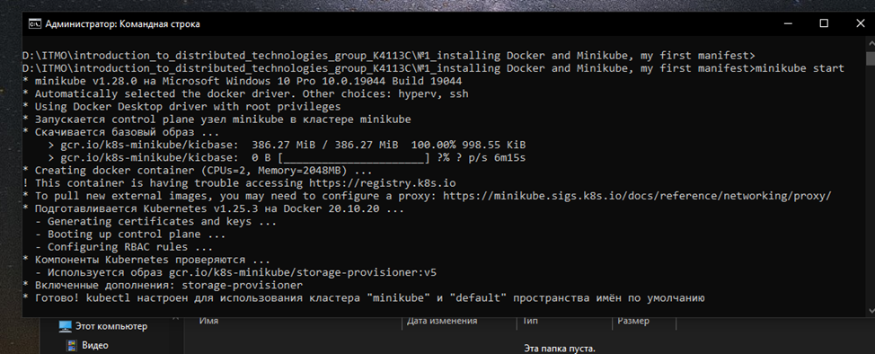
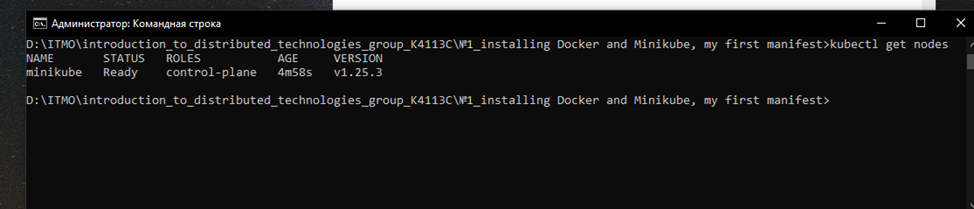
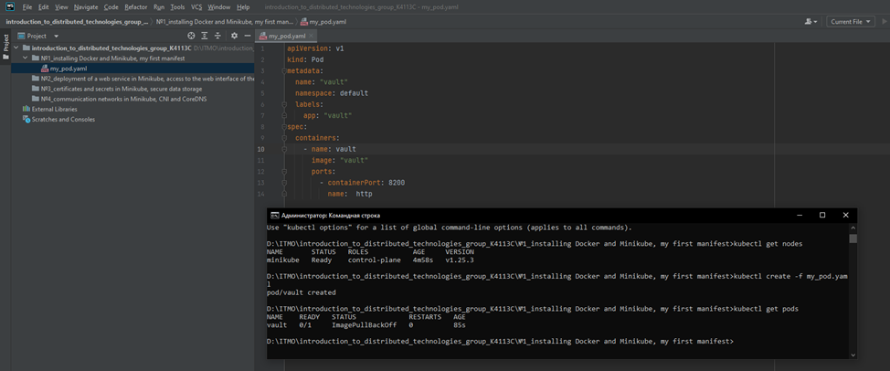
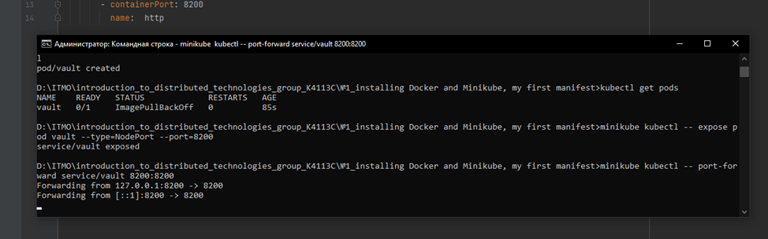
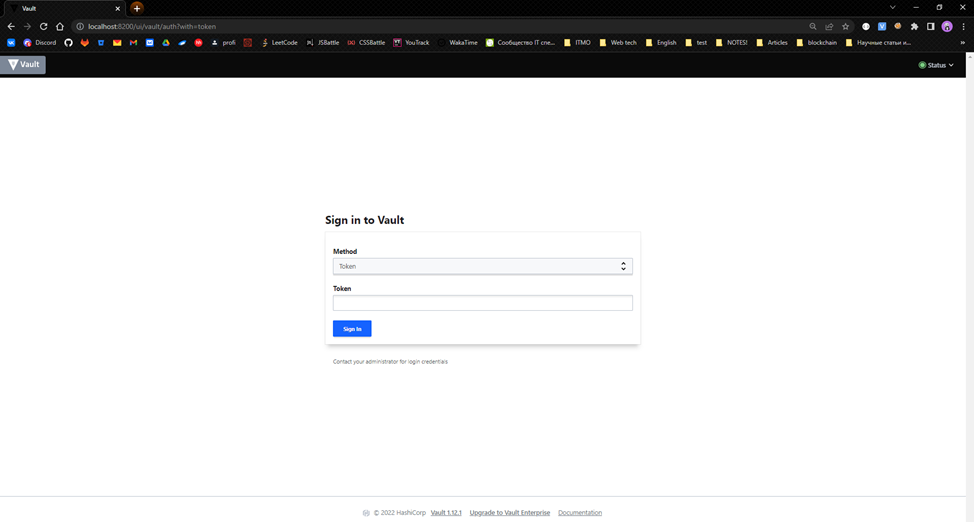
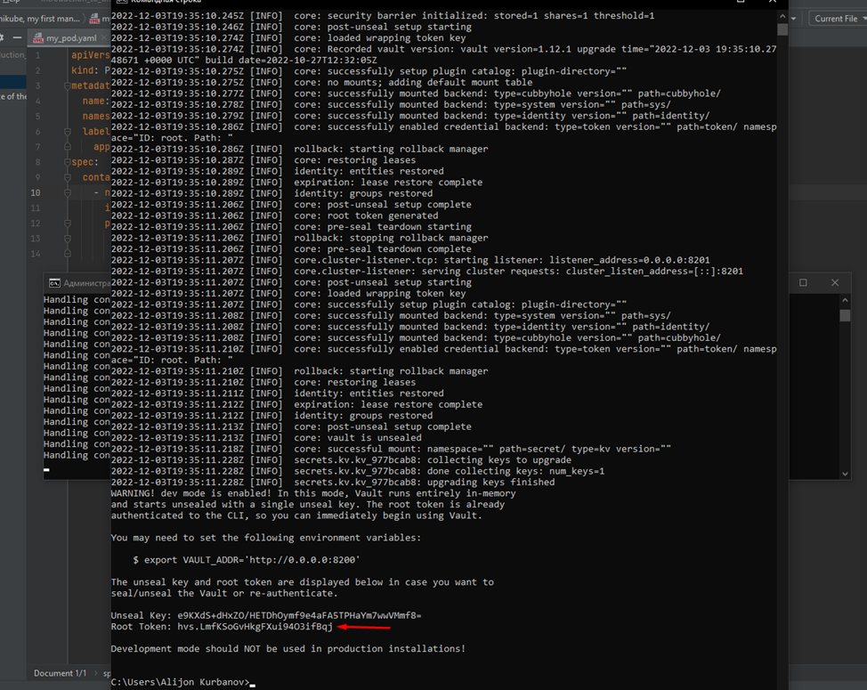
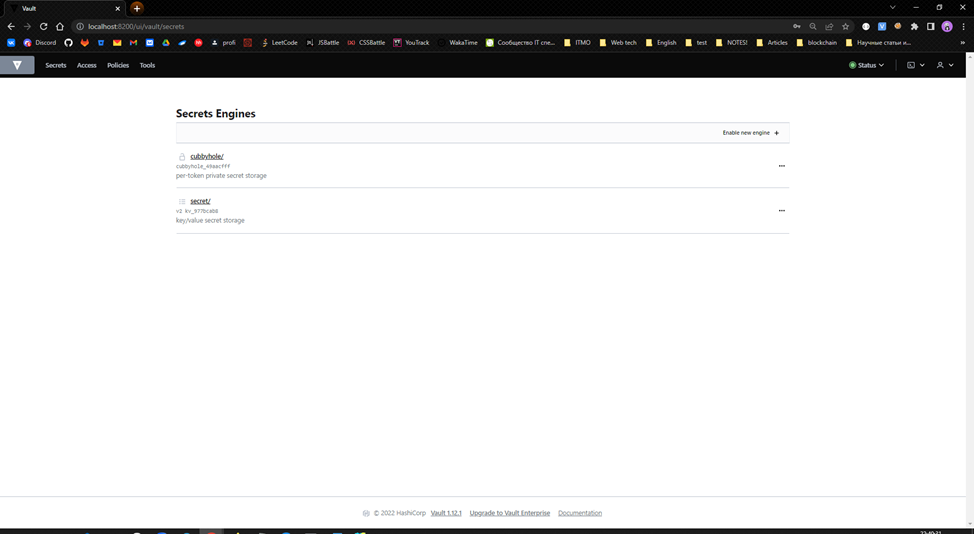
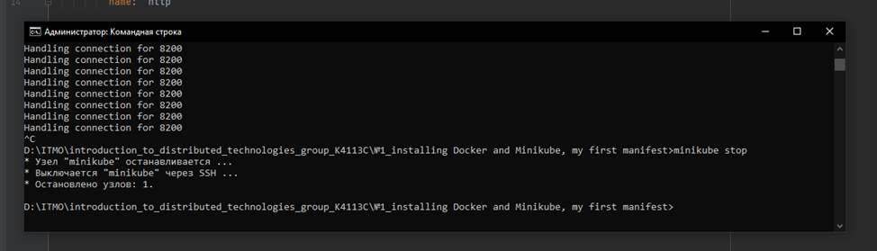

University: [ITMO University](https://itmo.ru/ru/)

Faculty: [FICT](https://fict.itmo.ru)

Course: [Introduction to distributed technologies](https://github.com/itmo-ict-faculty/introduction-to-distributed-technologies)

Year: 2022/2023

Group: K4113C

Author: Kurbanov Alijon

Lab: Lab1

Date of create: 01.12.2022

Date of finished: 04.12.2022

# Installing Docker and Minikube, my first manifest

## Description
This is the first lab where you can test Docker, install Minikube, and deploy your first Pod.

## Objective
Familiarize yourself with Minikube and Docker tools, deploy your first pod.

## Progress

1) Running minikube
```
# minikube start
```



2) Checking that a node has appeared
```
# kubectl get nodes
```



3) Creating a manifest file that will describe our pod.
4) Running
```
# kubectl create -f my_pod.yaml
```
5) Checking that pod has appeared
```
# kubectl get pods
```



6) Create a Pod Access Service
```
# minikube kubectl -- expose pod vault --type=NodePort --port=8200
```
7) Redirecting traffic from Pod to local
```
# minikube kubectl -- port-forward service/vault 8200:8200
```



8) Opening the Vault Login Page``http://localhost:8200``




9) Finding a token for authorization Vault ``(to a separate terminal)``
```
# minikube kubectl -- logs service/vault
```


10) Found token is put in the token field



11) The task completed - stop the node with the command
```
# minikube stop
```


12) Container and service organization scheme
