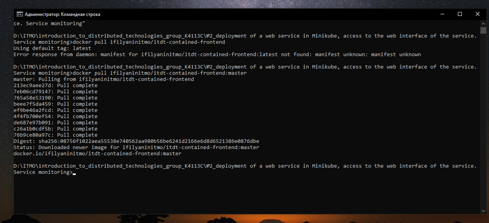
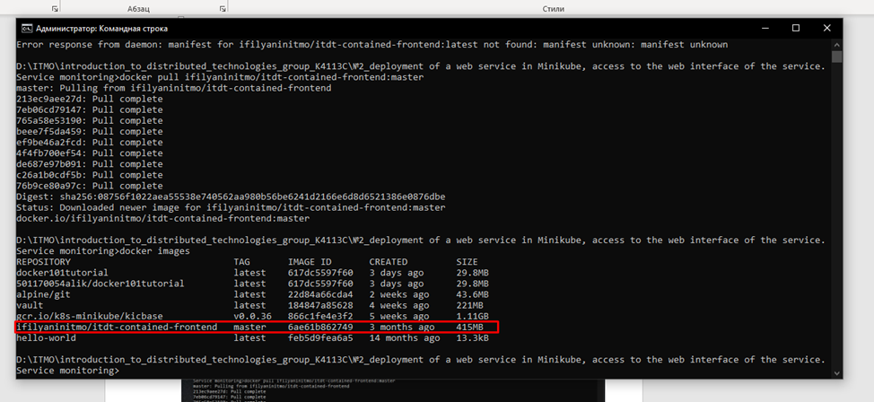
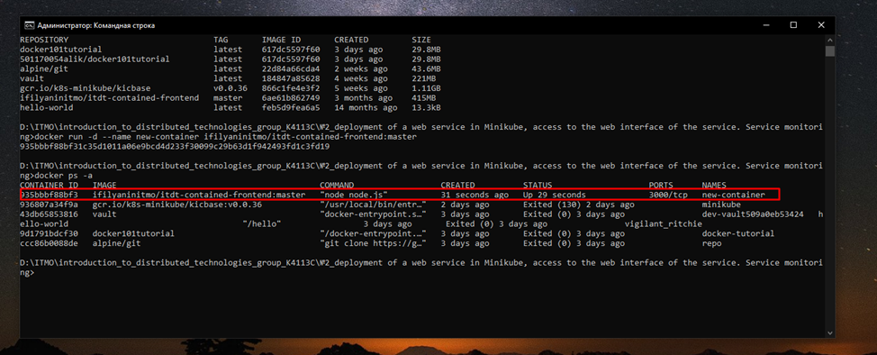
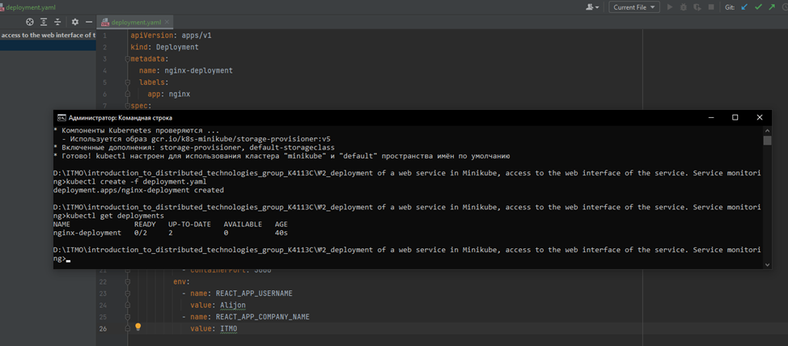
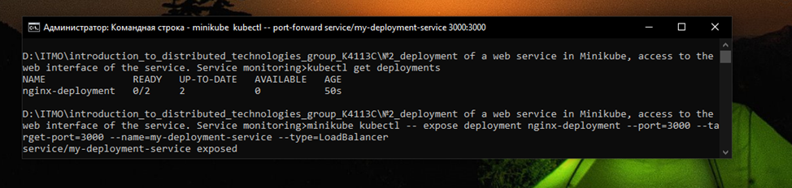
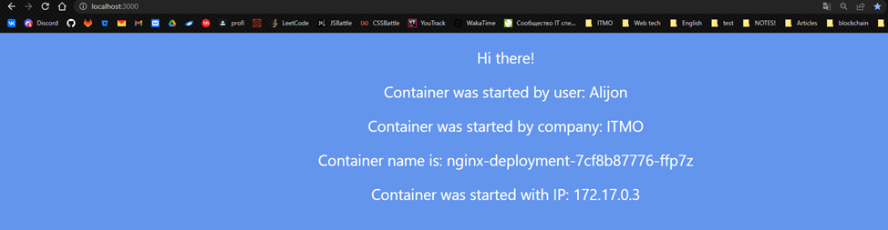
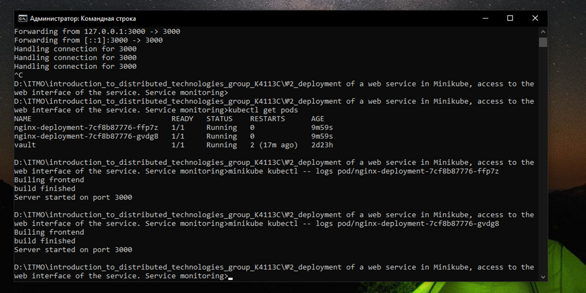

University: [ITMO University](https://itmo.ru/ru/)

Faculty: [FICT](https://fict.itmo.ru)

Course: [Introduction to distributed technologies](https://github.com/itmo-ict-faculty/introduction-to-distributed-technologies)

Year: 2022/2023

Group: K4113C

Author: Kurbanov Alijon

Lab: Lab2

Date of create: 05.12.2022

Date of finished: 06.12.2022

# Deployment of a web service in Minikube, access to the web interface of the service. Service monitoring.

## Description
In this lab, you will learn how to deploy a complete web service with multiple replicas.

## Objective
Familiarize yourself with the types of container deployment "controllers", familiarize yourself with network services and deploy your web application.

## Progress

1) Create a container
```
# docker pull ifilyaninitmo/itdt-contained-frontend:master
```


2) Checking that the container has appeared
```
# docker images
```


3) Create a container based on the itdt-contained-frontend image and checking that the container has appeared
```
# docker run -d --name new-container ifilyaninitmo/itdt-contained-frontend:master
# docker ps -a
```


4) Running minikube
5) Creating deployment
6) Checking that the deployment has appeared
```
# minikube start
# kubectl create -f deployment.yaml
# kubectl get deployments
```


7) Creating service
```
# minikube kubectl -- expose deployment nginx-deployment --port=3000 --target-port=3000 --name=my-deployment-service --type=LoadBalancer
```



8) Forwarding a local port to a container port
9) Opening the page
```
# minikube kubectl -- port-forward service/my-deployment-service 3000:3000
# http://localhost:3000
```


10) see the list of all pods
```
# minikube kubectl get pods
```


11) Looking at the logs of the first and second pods
```
# minikube kubectl -- logs pod/nginx-deployment-7cf8b87776-ffp7z
# minikube kubectl -- logs pod/nginx-deployment-7cf8b87776-gvdg8
```


12) Stop minikube
```
# minikube stop
```


13) Container and service organization scheme