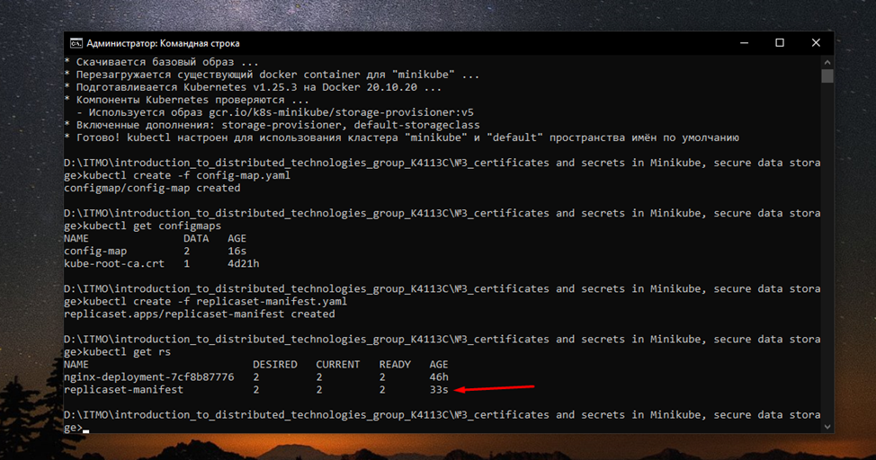

University: [ITMO University](https://itmo.ru/ru/)

Faculty: [FICT](https://fict.itmo.ru)

Course: [Introduction to distributed technologies](https://github.com/itmo-ict-faculty/introduction-to-distributed-technologies)

Year: 2022/2023

Group: K4113C

Author: Kurbanov Alijon

Lab: Lab3

Date of create: 07.12.2022

Date of finished: 10.12.2022

# Certificates and "secrets" in Minikube, secure data storage.

## Description

In this lab, you will learn about certificates and "secrets" in Minikube, the rules for storing data securely in Minikube.

## Objective
Get acquainted with certificates and "secrets" in Minikube, rules for secure data storage in Minikube.

## Progress

## Creating ConfigMap

1) Running minikube
```
# minikube start
```


2) Creating configMap
3) Running configMap
```
# kubectl create -f config-map.yaml
```
4) Checking that configMap has appeared
```
# kubectl get configmaps
```


## Creating ReplicaSet
5) Creating replicaSet 
6) Running replicaSet
```
# kubectl create -f replicaset-manifest.yaml
```
7) Checking that replicaSet has appeared
```
# kubectl get rs
```


## Creating Service
8) Creating service
9) Running service
```
# kubectl create -f new-service.yaml
```
10) Checking that service has appeared
```
# kubectl get services
```


## Generation TLS
11) Creating a private key
```
# openssl genrsa -out domain.key 2048
```
12) Creating a signature request
```
# openssl req -key domain.key -new -out domain.csr
```


13) create a private key and a public key signing request in one command:
```
# openssl req -newkey rsa:2048 -nodes -keyout domain.key -out domain.csr
```


14) View certificates
```
# openssl req -text -noout -verify -in domain.csr
```


## Creating Secret
15) creating secret and checking that secret has appeared
```
# kubectl create secret tls domain-tls --cert=domain.crt --key=domain.key
# minikube get secrets
```


## Creating Ingress
16) Connect Ingress to minikube
```
# minikube addons enable ingress
```

```
# minikube addons enable ingress-dns
```


17) Creating ingress manifest and checking that has appeared
```
# kubectl create -f ingress-manifest.yaml
# kubectl get ingress
```


Container and service organization scheme
