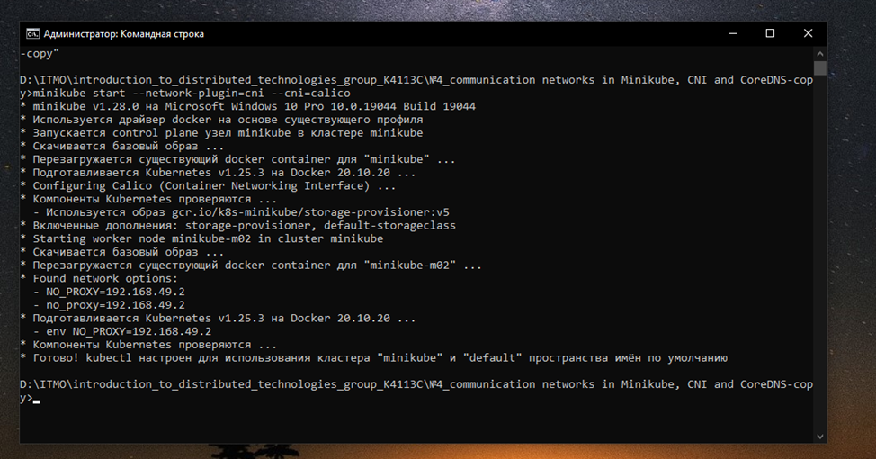
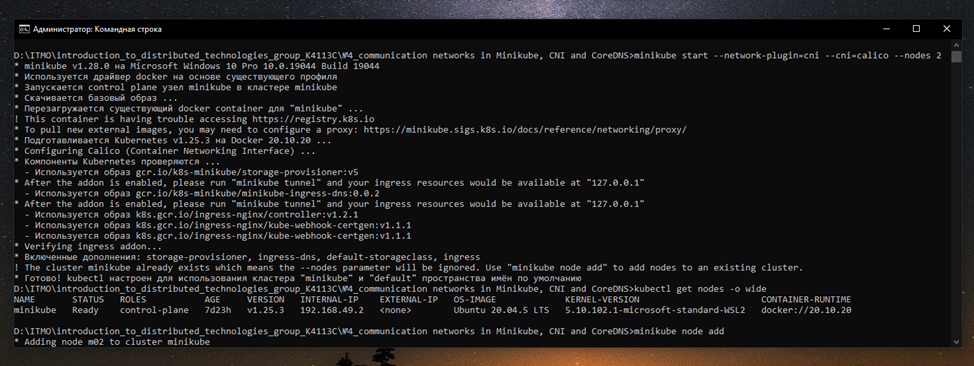
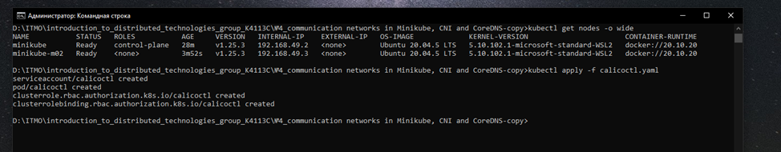
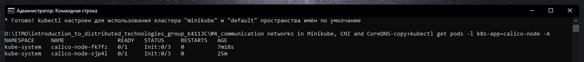
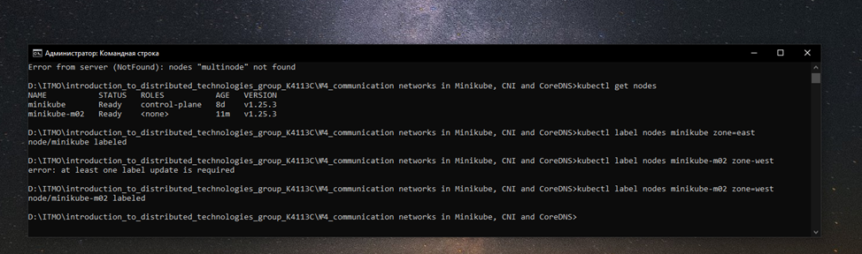
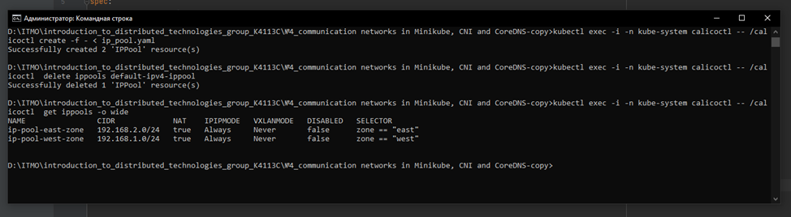
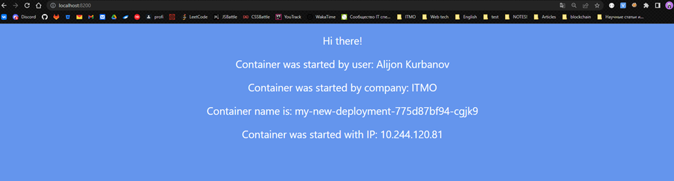
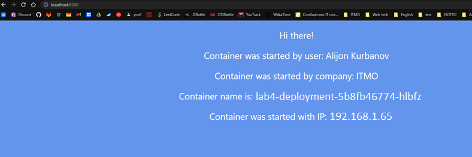
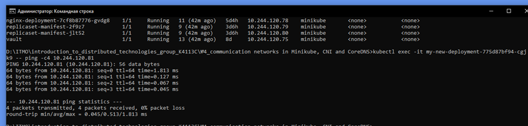
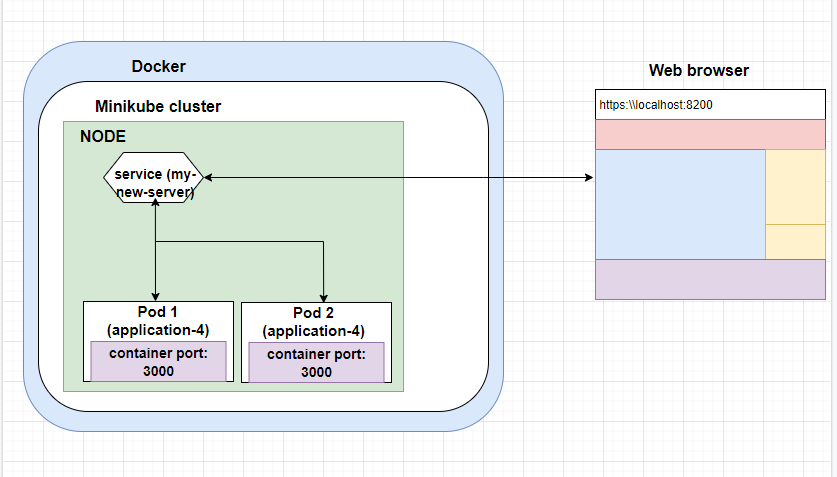

University: [ITMO University](https://itmo.ru/ru/)

Faculty: [FICT](https://fict.itmo.ru)

Course: [Introduction to distributed technologies](https://github.com/itmo-ict-faculty/introduction-to-distributed-technologies)

Year: 2022/2023

Group: K4113C

Author: Kurbanov Alijon

Lab: Lab4

Date of create: 10.12.2022

Date of finished: 14.12.2022

# Communication networks in Minikube, CNI and CoreDNS

## Description


This is the final lab that will introduce you to communication networks in Minikube. 
The peculiarity of Kubernetes is that underlay and overlay networks work at the same time, 
and management can be organized by various CNIs.

## Objective
Get to know CNI Calico and the IPAM Plugin function, learn how CNI and CoreDNS work.

## Progress

1) Create a single-node minikube cluster
```
# minikube start --network-plugin=cni --cni=calico
```


2) Creating a minikube cluster with 2 nodes
```
# minikube start --network-plugin=cni --cni=calico --nodes 2
```


3) Checking CNI Calico working and nodes count
```
# kubectl get nodes -o wide
```


4) Get the list of created nodes
```
# kubectl get pods -l k8s-app-calico-node -A 
```


5) Checking nodes that have appeared
6) Set labels for nodes
```
# kubectl get nodes
# kubectl label nodes minikube zone=east
node/minikube labeled
# kubectl label nodes minikube-m02 zone=west
node/minikube-m02 labeled
```


7) Creating an ip pool, remove the default pool
```
# kubectl exec -i -n kube-system calicoctl -- /calicoctl create -f - < ip_pool.yaml
# kubectl exec -i -n kube-system calicoctl -- /calicoctl  delete ippools default-ipv4-ippool
# kubectl exec -i -n kube-system calicoctl -- /calicoctl  get ippools -o wide
```


8) Creating deployment and service
```
# kubectl apply -f new-deployment.yaml
# kubectl apply -f last-server.yaml
# kubectl port-forward service/my-last-server 8200:3000
```


9) Checking the Container name and Container IP variables on the page in the web browser
```
# http://localhost:8200
```

After refreshing the page, the fields "Container name" and "Container IP" changed. the service distributes the load between existing replicas

10) Ping
```
# kubectl exec -it my-new-deployment-775d87bf94-cgjk9 -- ping -c4 10.244.120.81
```


11) Container and service organization scheme
